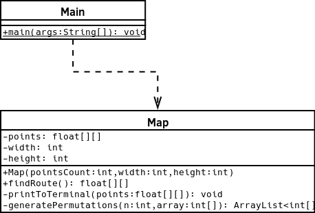
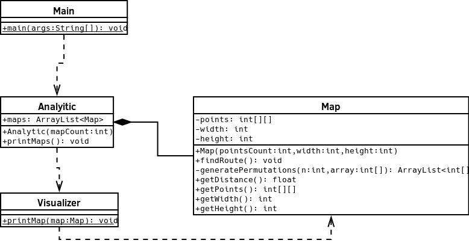

# Pflichtenheft

## Beschreibung:
Das Ziel ist es ein Programm zu schreiben, welches eine möglichst schnelle Route zwischen verschiedenen Punkten findet.

### Funktionale Anforderungen:

* [x] Das Programm soll mit einer beliebigen Anzahl Punkten umgehen können.
* [x] Als Start- und Endposition wird immer [0, 0] benutzt.
* [x] Die Punkte werden zufällig generiert in einem zweidimensionalen Koordinatensystem.
* [x] Es wird eine Visualisierung der Routen in Textform ausgegeben werden.

### Nonfunktionale Anforderungen:

* Das Programm soll möglichst modular aufgebaut sein.
* Es gibt keine unnötigen Outputs.
* Outputs sollen klar beschrieben werden.

### UML

#### Geplant:

#### Implementation:

