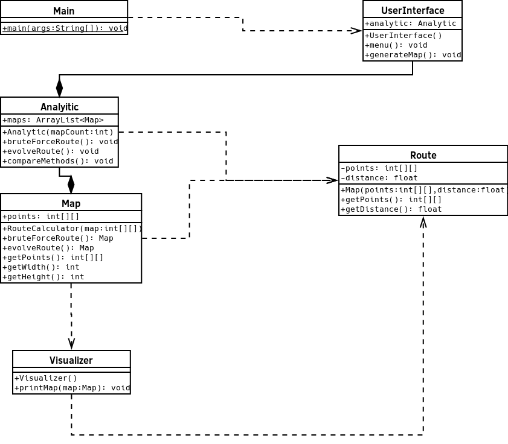

# Pflichtenheft

## Beschreibung:

Das bestehende Programm soll erweitert werden um eine schnellere Methode für die Berechnung eines Weges. Des weiteren soll es eine Möglichkeit geben, um die die beiden Methoden zeitlich und nach Distanz zu vergleichen.

### Funktionale Anforderungen:

* [x] Eine schnellere Methode für die Berechnung ist implementiert.
* [x] Es gibt ein textbasiertes Userinterface.
* [x] Ein Output für den Vergleich der beiden Methoden ist vorhanden.

### Nonfunktionale Anforderungen:

* Das User Interface soll simpel und klar aufgebaut sein.

### UML:

#### Geplant:

#### Implementation:

